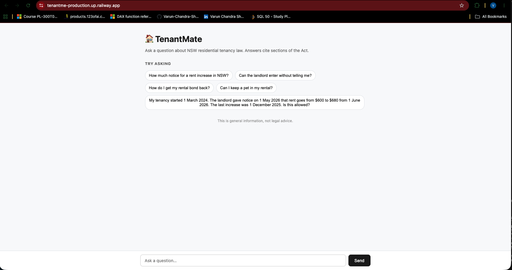
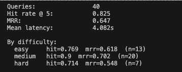
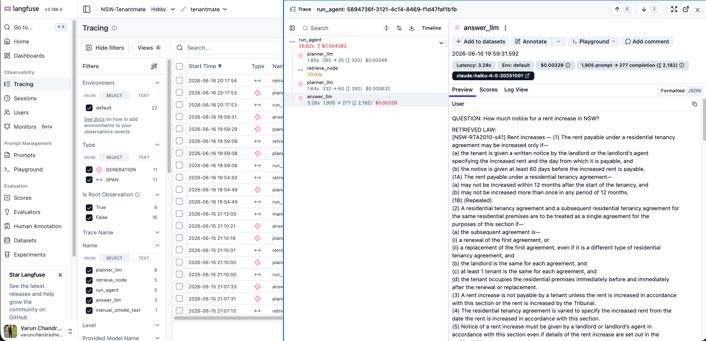
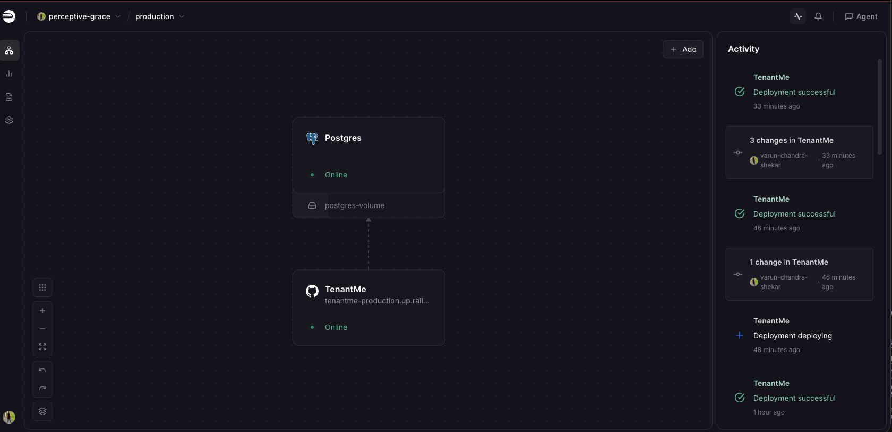

# 🏠 TenantMate

An agentic RAG system over the NSW Residential Tenancies Act 2010. Ask a question in plain English, get a grounded answer with section citations and structured verdicts from a deterministic calculator.

**🌐 Live:** https://tenantme-production.up.railway.app



---

## What it does

A tenant asks a question. The system:

1. **Rewrites the query** into the legal vocabulary of the Act (closes the gap between user words and legal terms)
2. **Retrieves** the most relevant sections via hybrid search (dense embeddings + BM25 + RRF fusion)
3. **Reranks** with a cross-encoder for precision
4. **Plans** via a LangGraph agent — should it retrieve more, call a calculator, or answer?
5. **Calculates deterministically** for rule-based questions (e.g. "is this rent increase legal?") using Python rules, not LLM reasoning
6. **Answers** with citations to specific sections of the Act and structured tool output

Every claim is grounded. Every section number cited. The calculator returns auditable verdicts, not text the LLM invented.

---

## Architecture

| Layer | Implementation |
|---|---|
| **Retrieval** | pgvector (HNSW cosine) + Postgres tsvector (BM25) + RRF fusion |
| **Embeddings** | BAAI/bge-small-en-v1.5 (384-dim) |
| **Reranker** | BAAI/bge-reranker-base (cross-encoder) |
| **Agent** | LangGraph state machine, bounded at 4 hops |
| **Tools** | Deterministic Python calculator with rules in config (jurisdiction-keyed) |
| **LLM** | Claude Haiku 4.5 for planner / rewriter / answer; Claude Opus 4.7 as eval judge |
| **API** | FastAPI |
| **Frontend** | Static HTML + vanilla JS, served from the same FastAPI app (one URL) |
| **Observability** | Langfuse — every node, LLM call, tool result traced |
| **Deployment** | Docker + Railway (managed Postgres with pgvector) |

---

## How to use it

### As a user

Visit [tenantme-production.up.railway.app](https://tenantme-production.up.railway.app). Click an example or type your own question.

First request takes ~30s (container cold-start). Subsequent ones land in 8–15s.

### As an API consumer

```bash
curl -X POST https://tenantme-production.up.railway.app/chat \
  -H "Content-Type: application/json" \
  -d '{"question": "How much notice for a rent increase in NSW?"}'
```

Response includes `answer`, `citations`, `rule_citations`, `tools_used`, `tool_results`, and `hops`. Structured output, not just prose.

### Run locally

```bash
git clone https://github.com/Varun-Chandra-Shekar/TenantMe
cd TenantMe

cp .env.example .env
# add your ANTHROPIC_API_KEY

docker compose up --build

# In a second terminal, ingest the corpus into your local DB (one time)
# Open notebooks/embed.ipynb and run all cells

# Open http://localhost:8000
```

---

## Engineering evidence

### Retrieval evaluation — 40-question golden set

| Stage | Hit @ 5 | MRR | Notes |
|---|---|---|---|
| Dense embedding only | 0.725 | 0.561 | Week 1 baseline |
| + Hybrid (BM25 + RRF) | 0.725 | 0.549 | No movement — diagnostic finding |
| + LLM query rewriting | 0.800 | 0.658 | +7.5pts hit rate, +29pts on hard slice |
| **+ Cross-encoder reranking** | **0.825** | **0.693** | Production stack |



### End-to-end quality (Ragas, Claude as judge)

- **Faithfulness:** 0.79 — % of answer claims grounded in retrieved context
- **Answer relevancy:** 0.76
- **Context precision:** 0.67
- **Context recall:** 0.66

### Observability

Every `/chat` request traces to Langfuse with nested spans for each node, LLM call, and tool result:



Tokens, cost, latency, model name — all visible per request. Failures surface at the dashboard, instead of being masked by plausible LLM reasoning.

### Deployment

Running on Railway with managed Postgres + pgvector. Auto-deploys from `dev` on every push.



---

## What I learned building this

Three honest moments that shaped the final design:

**Hybrid search didn't help on this corpus.** The textbook fix for "RAG isn't precise enough" is BM25 fusion. On my data it added zero (0.725 → 0.725). I diagnosed this by running BM25 in isolation on a known miss — BM25 returned zero results. The real bottleneck was a vocabulary gap between users ("evict") and the Act ("termination notice"). LLM query rewriting was the right fix (+29 hit-rate points on the hard slice).

**The agent silently lied to me once.** During development, my agent's answer looked correct, but the calculator was actually erroring on every call — three retries in a row. The LLM had masked the failures with plausible reasoning from retrieved text. I caught it only by inspecting `tool_results` in the response. This is why Langfuse is now in the stack — failures are no longer cosmetic.

**Context precision below 1.0 isn't always a failure.** My context precision sits at 0.67, the lowest of my four Ragas metrics. The instinct is to optimize. But legal text clusters topically — surfacing adjacent sections (s 41 + s 44 for a rent-increase question) is often *better* for the user than rigid top-1 retrieval. I documented it as a deliberate trade-off rather than chase the number.

---

## What's not here

Deliberate scope decisions:

- **Multi-jurisdiction (VIC, QLD)** — the architecture is jurisdiction-aware (chunk metadata + rules keyed per state), but only NSW is loaded
- **CI eval gate** — I run the eval manually before significant changes. Would automate this in a team setting where multiple people are committing
- **React/Vue frontend** — intentionally vanilla HTML/JS. The engineering value is in the agent + retrieval layer, not the UI. One URL, no frontend build step
- **Streaming responses** — quality over latency for this iteration. Cold start is ~30s, warm requests 8–15s. Sub-second would require caching, streaming, and a faster reranker

---

## Source

Source legislation: [Residential Tenancies Act 2010 (NSW)](https://legislation.nsw.gov.au/view/html/inforce/current/act-2010-042) — licensed under CC BY 4.0 by the Crown in right of the State of New South Wales.

TenantMate is general information, not legal advice. For binding guidance, consult Tenants NSW or a community legal centre.

---

## License

CC BY 4.0 — same as the source legislation.
